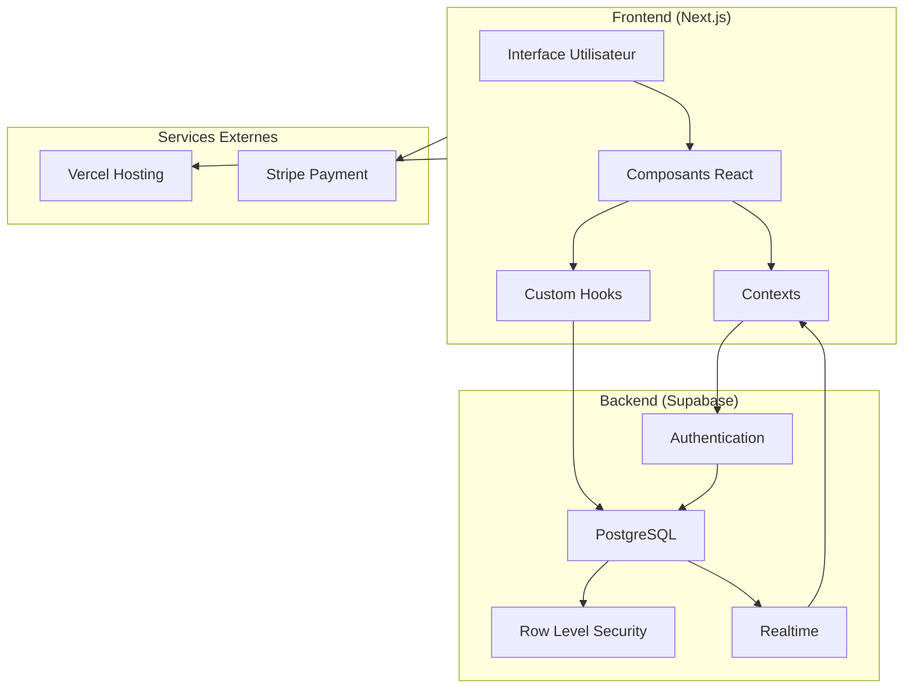
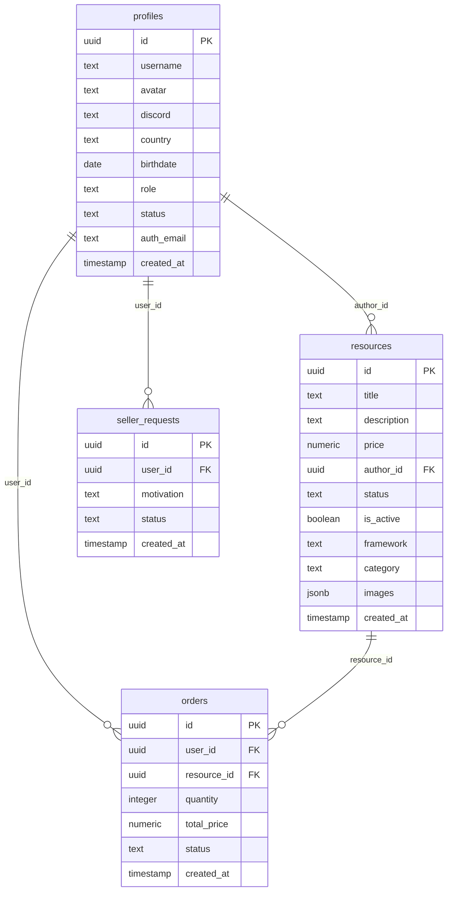
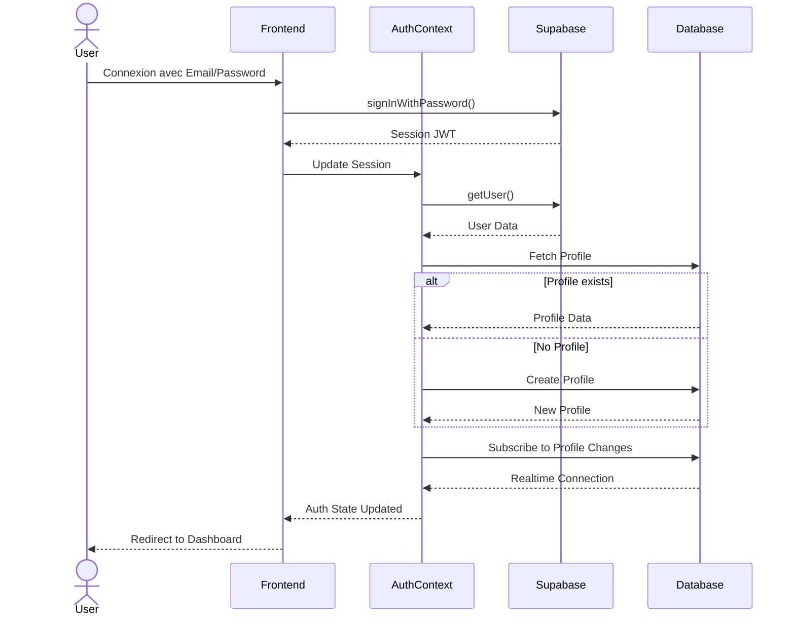
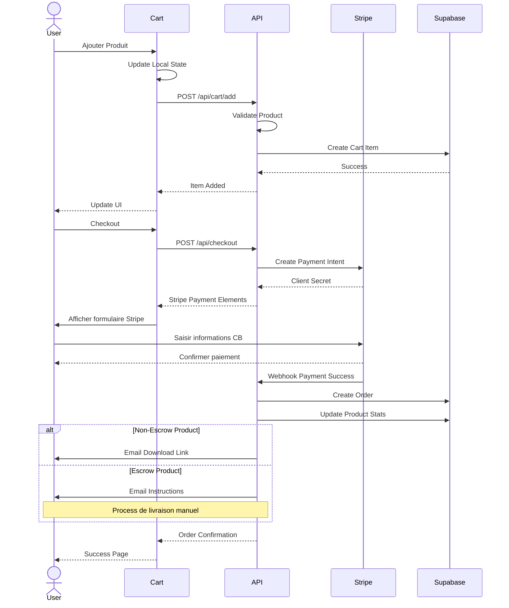

# FiveMarket - Documentation

## Table des matières
1. [Introduction](#introduction)
2. [Vue d'ensemble](#vue-densemble)
3. [Architecture](#architecture)
4. [Base de données](#base-de-données)
5. [API](#api)
6. [Fonctionnalités](#fonctionnalités)
7. [Sécurité](#sécurité)
8. [Frontend](#frontend)
9. [Déploiement](#déploiement)
10. [Maintenance](#maintenance)
11. [Roadmap](#roadmap)

## Introduction

FiveMarket est une marketplace moderne dédiée à la communauté FiveM, permettant l'achat et la vente de ressources de manière sécurisée et professionnelle.

### Technologies Utilisées
- **Frontend**: Next.js 13+, React, TypeScript, Tailwind CSS, Shadcn UI
- **Backend**: Supabase (PostgreSQL, Auth, Realtime)
- **Paiement**: Stripe
- **Hébergement**: Vercel

- **Autres**: ESLint, Prettier, Husky


## Vue d'ensemble

### Objectifs
- Fournir une plateforme sécurisée pour l'achat/vente de ressources FiveM
- Offrir une expérience utilisateur moderne et intuitive
- Garantir la qualité des ressources via un processus de modération
- Faciliter les transactions avec Stripe

### Utilisateurs Cibles
- **Acheteurs**: Propriétaires de serveurs FiveM
- **Vendeurs**: Développeurs de ressources
- **Administrateurs**: Équipe de modération

## Architecture

### Architecture Globale


### Structure des Dossiers
```
├── app/
│   ├── account/     # Gestion du compte
│   ├── admin/       # Dashboard admin
│   ├── api/         # Routes API
│   ├── auth/        # Authentification
│   ├── marketplace/ # Liste des produits
│   └── sell/        # Création/édition de produits
├── components/
│   ├── admin/       # Composants admin
│   ├── seller/      # Composants vendeur
│   └── ui/          # Composants UI réutilisables
├── contexts/        # Contextes React
├── hooks/           # Hooks personnalisés
├── lib/            # Utilitaires et types
├── public/         # Assets statiques
└── supabase/       # Migrations et politiques
```

## Base de données

### Structure de la Base de Données


### Structure du champ images (JSONB)
Le champ `images` de la table `resources` utilise le type JSONB pour stocker un tableau d'images :

```json
{
  "images": [
    {
      "id": "uuid-v4",
      "image": "base64_string",
      "is_thumbnail": true,
      "upload_order": 1,
      "created_at": "timestamp"
    }
  ]
}
```

### Politiques RLS

#### Profiles
```sql
-- Lecture publique limitée
CREATE POLICY "Lecture publique profiles" ON public.profiles
  FOR SELECT USING (true);

-- Modification par le propriétaire
CREATE POLICY "Les utilisateurs peuvent modifier leur profil" ON public.profiles
  FOR UPDATE USING (auth.uid() = id);
```

#### Resources
```sql
-- Lecture publique des ressources actives
CREATE POLICY "Ressources publiques" ON public.resources
  FOR SELECT USING (is_active = true AND status = 'published');

-- Modification par l'auteur
CREATE POLICY "Les vendeurs peuvent gérer leurs ressources" ON public.resources
  FOR ALL USING (author_id = auth.uid());
```

## API

### Routes Principales

#### Types
```typescript
interface ResourceImage {
  id: string;
  image: string; // base64
  is_thumbnail: boolean;
  upload_order: number;
  created_at: string;
}

interface Resource {
  id: string;
  title: string;
  description: string;
  price: number;
  author_id: string;
  framework?: 'ESX' | 'QBCore' | 'Standalone';
  category?: 'Police' | 'Civilian' | 'UI' | 'Jobs' | 'Vehicles';
  status: 'draft' | 'published';
  is_active: boolean;
  images: ResourceImage[];
  created_at: string;
}
```

#### Resources API
```typescript
// GET /api/resources
interface GetResourcesResponse {
  resources: Resource[];
  count: number;
}

// POST /api/resources
interface CreateResourceRequest {
  title: string;
  description: string;
  price: number;
  framework?: string;
  category?: string;
  resource_type: 'escrow' | 'non_escrow';
  images: {
    image: string; // base64
    is_thumbnail: boolean;
  }[];
}

// PATCH /api/resources/[id]
interface UpdateResourceRequest {
  title?: string;
  description?: string;
  price?: number;
  framework?: string;
  category?: string;
  status?: 'draft' | 'published';
  is_active?: boolean;
  images?: {
    id?: string; // Pour mettre à jour une image existante
    image: string;
    is_thumbnail: boolean;
    upload_order?: number;
  }[];
}

// Exemple d'utilisation avec Supabase
const updateResource = async (id: string, data: UpdateResourceRequest) => {
  const { data: resource, error } = await supabase
    .from('resources')
    .update({
      ...data,
      images: data.images 
        ? data.images.map((img, index) => ({
            id: img.id || uuidv4(),
            image: img.image,
            is_thumbnail: img.is_thumbnail,
            upload_order: img.upload_order || index + 1,
            created_at: new Date().toISOString()
          }))
        : undefined
    })
    .eq('id', id)
    .select()
    .single();
};
```

### Flux d'Authentification


### Processus de Paiement


## Fonctionnalités

### 1. Système d'Authentification
- Inscription/Connexion via Supabase Auth
- Gestion des profils utilisateurs
- Upload d'avatar avec crop circulaire (base64)
- Mise à jour en temps réel

### 2. Marketplace
- Catalogue de produits avec filtres
- Système de recherche avancé
- Gestion des catégories et frameworks
- Prévisualisation des ressources

### 3. Système de Vente
- Interface de création intuitive
- Upload d'images avec prévisualisation
- Gestion des versions
- Statistiques de vente

### 4. Administration
- Dashboard complet
- Gestion des utilisateurs
- Modération des ressources
- Statistiques globales

## Sécurité

### Authentification
- JWT avec Supabase Auth
- Sessions sécurisées
- Refresh tokens

### Autorisations
- Row Level Security (RLS)
- Middleware de protection
- Validation des rôles

### Paiements
- Intégration Stripe
- Webhooks sécurisés
- Gestion des remboursements

## Frontend

### Composants UI
- Design system cohérent
- Composants réutilisables
- Thème personnalisé

### État Global
- React Context
- Supabase Realtime
- Custom Hooks

## Déploiement

### Services requis
- Compte Vercel
- Projet Supabase
- Compte Stripe


## Maintenance

### Mises à Jour


### Monitoring
- Logs d'erreurs
- Métriques Supabase
- Analytics Vercel

## Roadmap MVP (4 Semaines)


### Semaine 1 : Base & Authentification
- [ ] Configuration des services (Supabase, Stripe)
- [ ] Système d'authentification
- [ ] Gestion des profils utilisateurs
- [ ] Upload d'avatar avec crop
- [ ] Dashboard utilisateur basique

### Semaine 2 : Marketplace Core
- [ ] CRUD des produits
- [ ] Upload d'images avec preview
- [ ] Système de catégories
- [ ] Page produit détaillée
- [ ] Recherche simple

### Semaine 3 : Paiement & Livraison
- [ ] Intégration Stripe
- [ ] Panier d'achat
- [ ] Processus de checkout
- [ ] Système de livraison (escrow/non-escrow)
- [ ] Emails de confirmation

### Semaine 4 : Admin & Polish
- [ ] Dashboard admin
- [ ] Modération des produits
- [ ] Gestion des vendeurs
- [ ] UI/UX final
- [ ] Tests et déploiement

### Post-MVP (Prochaines Étapes)
1. **Améliorations Immédiates**
   - Système de commentaires
   - Notifications temps réel
   - Système de notes
   - Filtres avancés

2. **Fonctionnalités Business**
   - Système d'affiliation
   - Statistiques avancées
   - API publique
   - Support multi-langues

3. **Fonctionnalités Communauté**
   - Intégration Discord
   - Forum d'entraide
   - Système de tickets
   - Marketplace de services