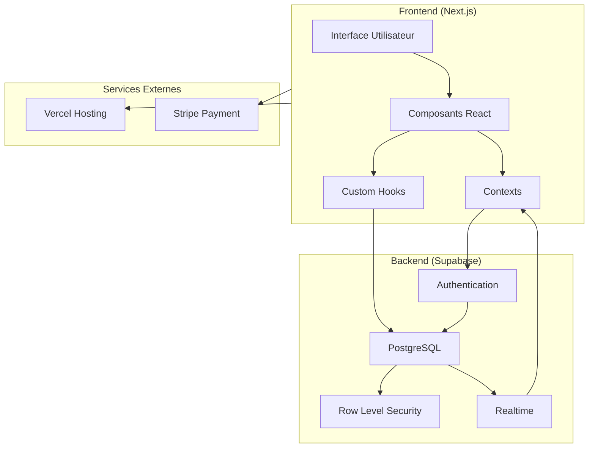

# Architecture Globale

## Vue d'ensemble

## Composants principaux

### Frontend (Next.js)
- **Interface Utilisateur** : Pages et composants React
- **Composants React** : Composants réutilisables
- **Contexts** : Gestion de l'état global
- **Custom Hooks** : Logique réutilisable

### Backend (Supabase)
- **Authentication** : Gestion des utilisateurs
- **PostgreSQL** : Base de données principale
- **Row Level Security** : Sécurité au niveau des données
- **Realtime** : Mises à jour en temps réel

### Services Externes
- **Vercel** : Hébergement et déploiement
- **Stripe** : Gestion des paiements

## Flux de données

1. **Authentification**
   - Gestion via Supabase Auth
   - JWT pour les sessions
   - Refresh tokens automatiques

2. **Données**
   - API Routes Next.js
   - Requêtes Supabase
   - Politiques RLS
   - Subscriptions Realtime

3. **Paiements**
   - Intégration Stripe
   - Webhooks sécurisés
   - Confirmation asynchrone
